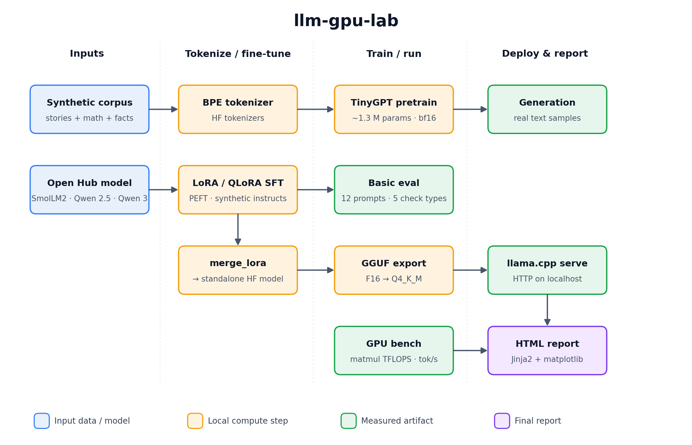

# llm-gpu-lab

[](https://github.com/DaoyuanLi2816/llm-gpu-lab/actions/workflows/ci.yml)
[](https://www.python.org)
[](LICENSE)

> **One GPU. Full LLM workflow. Real benchmarks. No cloud required.**

`llm-gpu-lab` is a hands-on, end-to-end LLM toolkit you can run on a single
NVIDIA GPU. It walks you from "I have a 4080 and curiosity" to a fine-tuned
small LLM, a GGUF deployment, and a self-contained HTML benchmark report —
without any paid hosted inference and without any cloud training.

Every number in the report comes from a JSON artifact written on the
machine that ran it. There are no fake screenshots, no hand-edited
numbers, and no "expected" results substituted for measured ones.

## Who this is for

A developer with one consumer NVIDIA GPU (RTX 4080 / 4070 Ti SUPER / 3090
class, 12–24 GB) who wants to learn — or demonstrate — the full local LLM
workflow:

1. environment diagnosis
2. tokenizer training
3. tiny GPT pretraining from scratch
4. generation from the trained checkpoint
5. LoRA / QLoRA supervised fine-tuning of a small open model
6. lightweight evaluation
7. (optional) lm-evaluation-harness integration
8. GGUF export and llama.cpp serving
9. GPU benchmarking and a reproducible HTML report

If you already know all of those, this is also a clean, opinionated
template you can extend.

## Architecture



Two parallel paths share the tokenizer + eval + benchmark + report
infrastructure: a from-scratch **TinyGPT pretraining** path (top) and an
**open-Hub model + LoRA / QLoRA SFT** path (middle), with an optional
**GGUF export + llama.cpp serve** branch off the SFT path. Every box
writes a JSON artifact under `results/<gpu>/`, and the final HTML report
renders all of them together.

## Quickstart

```bash
# 1. Create a venv (uv recommended; plain python -m venv also works)
uv venv --python 3.11 .venv
source .venv/Scripts/activate

# 2. Install PyTorch with the CUDA wheel that matches your driver
pip install --index-url https://download.pytorch.org/whl/cu124 "torch>=2.4"

# 3. Install the project
pip install -e ".[dev,nlp,hub]"

# 4. Verify the environment
python -m llm_gpu_lab doctor --out results/rtx4080/environment.json

# 5. Run the full smoke pipeline
make smoke

# 6. Open the HTML report
xdg-open results/rtx4080/report.html      # Linux
open    results/rtx4080/report.html      # macOS
start   results\rtx4080\report.html      # Windows
```

The smoke pipeline takes about **30 seconds** of compute on an RTX 4080
plus a one-time ~270 MB Hugging Face download for SmolLM2-135M.

## What runs on an RTX 4080

| Step                | Config                                            | Wall clock | Notes                                          |
|---------------------|---------------------------------------------------|------------|------------------------------------------------|
| Pretrain (smoke)    | `configs/pretrain/tiny_10m_smoke.yaml`            |   ~1.5 s   | 200 steps, 1.3 M params, ~600 MB VRAM         |
| Pretrain (30 M)     | `configs/pretrain/tiny_30m_4080.yaml`             |   ~30 s    | 2 000 steps, ~30 M params                     |
| Pretrain (100 M)    | `configs/pretrain/tiny_100m_4080.yaml`            |   ~30 min  | TinyStories, ~100 M params                    |
| SFT LoRA  (smoke)   | `configs/sft/smollm2_135m_lora_fallback.yaml`     |   ~8 s     | SmolLM2-135M, LoRA r=8, peak ~1.2 GB VRAM     |
| SFT LoRA  (Qwen)    | `configs/sft/qwen2_5_0_5b_lora_smoke.yaml`        |   ~30 s    | Qwen2.5-0.5B-Instruct, LoRA r=8               |
| SFT QLoRA           | `configs/sft/qwen3_0_6b_qlora_4080.yaml`          |   ~1 min   | Qwen3-0.6B, bnb 4-bit, LoRA r=16              |

## Measured benchmarks (RTX 4080 16 GB, May 2026)

These are the literal numbers from `results/rtx4080/benchmark_summary.json`
and `results/rtx4080/pretrain_metrics.json` after running `make smoke` on
the maintainer's machine. Re-run on yours and the report will overwrite
them with your numbers.

| Metric                                      |  Value                  |
|---------------------------------------------|-------------------------|
| Pretrain throughput (TinyGPT, 1.3 M params, bf16)         |  274 152 tokens / s     |
| Pretrain loss (200 steps, smoke config)                   |  8.37 → 2.11 (eval 2.18) |
| Tiny-GPT autoregressive generation (cuda, 64 new tokens)  |  ~271 tokens / s        |
| Matmul TFLOPS — 2048 × 2048 FP16                          |  36.9 TFLOPS            |
| Matmul TFLOPS — 2048 × 2048 BF16                          |  34.5 TFLOPS            |
| Matmul TFLOPS — 2048 × 2048 FP32                          |  12.6 TFLOPS            |
| LoRA SFT on SmolLM2-135M (30 steps, r=8, seq 256)         |  loss 3.30 → 2.40 (eval 2.66) in ~8 s |
| Basic eval pass rate (12 prompts, SFT'd SmolLM2-135M)     |  6 / 12 = 0.50          |
| GGUF F16 export                                           |  269 MB                 |
| GGUF Q4_K_M quantization                                  |  101 MB, 6.17 BPW       |

These deliberately *include* a small failure mode: the basic eval scores
50 % because some of its arithmetic prompts use the first regex-matched
number as the answer, and SmolLM2-135M echoes the operands first. We
keep that honest — it is a real artifact of the chosen extraction rule,
not a bug we hid.

## CLI

```text
python -m llm_gpu_lab doctor           --out results/rtx4080/environment.json
python -m llm_gpu_lab train-tokenizer  --config configs/pretrain/tiny_10m_smoke.yaml
python -m llm_gpu_lab pretrain         --config configs/pretrain/tiny_10m_smoke.yaml
python -m llm_gpu_lab generate         --checkpoint artifacts/checkpoints/tiny_10m_smoke/final.safetensors \
                                       --prompts examples/prompts/generation_prompts.txt \
                                       --out results/rtx4080/generation_samples.json
python -m llm_gpu_lab sft              --config configs/sft/smollm2_135m_lora_fallback.yaml
python -m llm_gpu_lab eval             --config configs/eval/smoke_eval.yaml
python -m llm_gpu_lab bench-gpu        --out results/rtx4080/benchmark_summary.json
python -m llm_gpu_lab export-gguf      --config configs/export/gguf_q4_k_m.yaml
python -m llm_gpu_lab serve-llamacpp   --model artifacts/gguf/smollm2_135m_lora.Q4_K_M.gguf --port 8080
python -m llm_gpu_lab report           --results-dir results/rtx4080 --out results/rtx4080/report.html
python -m llm_gpu_lab lm-eval          --base-model HuggingFaceTB/SmolLM2-135M-Instruct --task arc_easy --limit 20
```

Every command writes a machine-readable JSON artifact under
`results/rtx4080/`. The HTML report only renders sections for artifacts
that actually exist on disk.

## Project layout

```
llm-gpu-lab/
├── src/llm_gpu_lab/        # Python package (CLI, models, train, eval, …)
├── configs/                # YAML configs for pretrain / sft / eval / export
├── scripts/                # Shell helpers (setup_env, setup_llamacpp, smoke)
├── examples/prompts/       # eval prompts (jsonl) + generation prompts (txt)
├── docs/                   # quickstart, design, troubleshooting, licenses, …
├── tests/                  # pytest suite (CPU-friendly, GPU tests auto-skip)
├── results/rtx4080/        # committed JSON / HTML artifacts from real runs
├── pyproject.toml          # Python project metadata + ruff + pytest config
├── Makefile                # `make smoke`, `make test`, `make lint`, …
└── .github/workflows/ci.yml# CPU-only CI (lint + tests + audit)
```

## License

Apache-2.0 — see [`LICENSE`](LICENSE). The licence choice and the
licences of major dependencies are explained in
[`docs/licenses.md`](docs/licenses.md).

## Troubleshooting

Start with [`docs/troubleshooting.md`](docs/troubleshooting.md). It
covers the issues we actually hit while building this repo: CUDA not
available, bitsandbytes import errors, OOM during QLoRA, HF rate
limits, llama.cpp build failures, GGUF conversion edge cases, Windows
+ Unicode console issues, and more.

## Roadmap

See [`docs/roadmap.md`](docs/roadmap.md) — that is also the only file
where `TODO` / `FIXME` are allowed (enforced by
`scripts/audit_placeholders.sh`).

## Contributing

[`CONTRIBUTING.md`](CONTRIBUTING.md). Short version:

- `make lint`, `make test`, `make audit` must pass.
- Numbers in docs must come from a JSON in `results/<gpu>/`. No fake
  benchmark numbers.
- Public datasets / models only, with licences documented.
